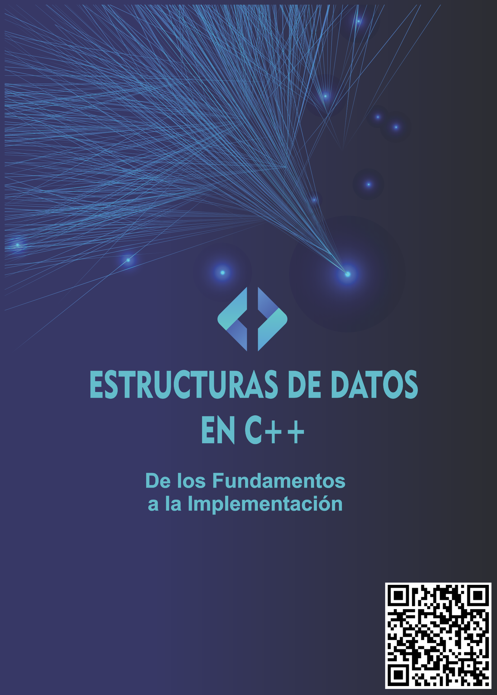

<!-- PORTADA -->
<div align="center">
  
</div>

<br><br><br>


<!-- ENCABEZADO CON IMÁGENES -->
<div align="center">
  <table width="100%">
    <tr>
      <td width="20%" align="left">
        
      </td>
      <td width="60%" align="center">
        <h1 style="color:#0077b6;">UNIVERSIDAD NACIONAL DEL ALTIPLANO</h1>
        <h3 style="color:#023e8a;">Facultad de Ingeniería Estadística e Informática</h3>
        <p>
      </td>
      <td width="20%" align="right">
        
      </td>
    </tr>
  </table>
    <p><strong>Alumno:</strong> Paul Edward Mamani Vilca</p>  <strong>Codigo:</strong> 241199</p>
    <strong>Curso:</strong> Estructura de Datos</p>
    <strong>Docente:</strong> Fred Torres Cruz</p>
</div>

---

- [Introducción](#introducción)
- [I Operadores](#i-operadores)
- [II Estructuras De Control](#ii-estructuras-de-control)
- [III Funciones](#iii-funciones)
- [IV Arrays](#iv-arrays)
- [V Punteros y Referencias](#v-punteros-y-referencias)
- [VI Operadores tipo \& y \*](#vi-operadores-tipo--y-)
- [VII Entrada y Salida de Datos](#vii-entrada-y-salida-de-datos)
- [VIII Tipos de Datos, Variables y Constantes](#viii-tipos-de-datos-variables-y-constantes)
- [IX Comentarios y estructura de un programa](#ix-comentarios-y-estructura-de-un-programa)
- [X Listas Enlazadas](#x-listas-enlazadas)
- [XI Listas Doblemente Enlazadas](#xi-listas-doblemente-enlazadas)
- [XII Listas Circulares](#xii-listas-circulares)
- [XIII Colas (Queues)](#xiii-colas-queues)
- [XIV Pilas (Stacks)](#xiv-pilas-stacks)
- [XV Vectores Standard Template Library (STL)](#xv-vectores-standard-template-library-stl)
- [XVI Recursión](#xvi-recursión)
- [XVII Matrices](#xvii-matrices)
- [XVIII Uso de Estructuras (Structs)](#xviii-uso-de-estructuras-structs)
- [XIX Arboles Binarios](#xix-arboles-binarios)
- [XX Arboles Binarios de Búsqueda (BST)](#xx-arboles-binarios-de-búsqueda-bst)
- [XXI Arboles AVL](#xxi-arboles-avl)
- [XXII Librerias y Cabeceras en C++](#xxii-librerias-y-cabeceras-en-c)
- [XXIII Buenas Prácticas de Programación](#xxiii-buenas-prácticas-de-programación)
- [XXIV Conclusión](#xxiv-conclusión)
  


## Introducción


La programación no se trata únicamente de escribir líneas de código que funcionen, sino de **construir soluciones sólidas, eficientes y sostenibles**. En este contexto, las **estructuras de datos** se presentan como los cimientos que permiten que las aplicaciones sean rápidas, escalables y comprensibles.

Imagina que cada problema que enfrentamos es un laberinto de decisiones, condiciones y datos. Sin una estrategia adecuada para organizar esa información, hasta el algoritmo más brillante se vuelve lento e ineficiente. Es aquí donde las estructuras de datos hacen su entrada: **listas, árboles, pilas, colas, vectores, matrices** y muchas otras herramientas que forman el lenguaje silencioso de la optimización.

Este libro ha sido diseñado no solo para enseñar conceptos técnicos, sino para **despertar una forma diferente de pensar**. Aprenderás a observar los problemas desde una perspectiva estructurada y ordenada. Con ejemplos claros, explicaciones paso a paso, prácticas dirigidas y reflexiones que conectan la teoría con la realidad, irás construyendo tu camino como programador.

Pero más allá del código, hay algo fundamental: el hábito de **escribir bien**, de **pensar antes de programar**, de **estructurar antes de ejecutar**.

Este no es un manual más. Es un recorrido desde lo básico hasta lo profundo, desde las operaciones simples hasta los árboles que crecen solos, desde los arrays estáticos hasta los nodos que se enlazan dinámicamente en memoria. Todo con un único propósito:

> Que comprendas que **una estructura de datos bien elegida puede cambiarlo todo**.

Bienvenido a este viaje. Tu viaje como desarrollador consciente, como constructor de soluciones. Porque programar no es solo hacer que algo funcione. Es hacer que funcione **mejor**.

---


## I Operadores

Los **operadores** en C++ son símbolos especiales que le indican al compilador que debe realizar una operación específica entre una o más variables. Son el **lenguaje de acción del código**, permitiendo desde cálculos simples hasta decisiones lógicas y manipulaciones complejas.

**Clasificación principal:**

- **Aritméticos**: `+`, `-`, `*`, `/`, `%`  
  Realizan operaciones matemáticas básicas.

- **Relacionales**: `==`, `!=`, `>`, `<`, `>=`, `<=`  
  Comparan valores y devuelven `true` o `false`.

- **Lógicos**: `&&`, `||`, `!`  
  Usados para combinar o negar condiciones booleanas.

- **Asignación**: `=`, `+=`, `-=`, `*=`, `/=`  
  Asignan valores a variables.

- **Incremento/Decremento**: `++`, `--`  
  Aumentan o disminuyen una variable en 1.

- **Bit a bit**: `&`, `|`, `^`, `<<`, `>>`  
  Manipulan bits directamente (avanzado).

---

**Ejemplo:**
```cpp
#include <iostream>
using namespace std;

int main() {
    int a = 10, b = 3;
    
    cout << "Suma: " << a + b << endl;
    cout << "Resta: " << a - b << endl;
    cout << "Multiplicación: " << a * b << endl;
    cout << "División: " << a / b << endl;
    cout << "¿a es mayor que b?: " << (a > b) << endl;
    return 0;
}

```
**Explicación paso a paso:**

1. Se declaran dos variables a y b.

2. Se realizan varias operaciones aritméticas básicas.

3. También se evalúa una comparación (a > b) para obtener un resultado booleano.

Los resultados se imprimen en la consola usando cout.

***Resultado esperado en pantalla:***
```cpp
Suma: 13
Resta: 7
Multiplicación: 30
División: 3
¿a es mayor que b?: 1

```
>***Nota: en C++, true se muestra como 1, y false como 0***

***Ideas Clave***

- Los operadores son símbolos que desencadenan acciones computacionales.

- Su buen uso permite crear expresiones potentes y claras.

- Combinarlos correctamente es esencial para la lógica algorítmica.

**Practica 1**

> *Calcular el promedio de 3 notas.*

```cpp
#include <iostream>
using namespace std;

int main() {
    float n1 = 15.5, n2 = 18.0, n3 = 17.5;
    float promedio = (n1 + n2 + n3) / 3;
    cout << "Promedio: " << promedio << endl;
    return 0;
}

```


**Practica 2**

> *Verificar si un número ingresado por el usuario es par:*

```cpp
#include <iostream>
using namespace std;

int main() {
    int numero;
    cout << "Ingrese un número: ";
    cin >> numero;

    if (numero % 2 == 0)
        cout << "Es par" << endl;
    else
        cout << "Es impar" << endl;

    return 0;
}

```

**Conclusión**
Los operadores son el conjunto de herramientas fundamentales del programador. Permiten ejecutar operaciones, comparar valores y construir expresiones complejas que dan vida a la lógica del programa.

**Puntos Clave**
- Son esenciales en cálculos, decisiones y asignaciones.

- Permiten manipular, comparar y evaluar datos.

- Aprender a usarlos correctamente es la base para escribir código claro y efectivo.
- 
**Reflexión Final**
>*Los operadores no son solo símbolos: son los comandos que hacen hablar al código, las reglas matemáticas que hacen que el programa cobre vida.*

---

## II Estructuras De Control

Las **estructuras de control** son la columna vertebral de la lógica en la programación. Permiten decidir qué instrucciones se ejecutan, en qué momento y cuántas veces. Gracias a ellas, un programa puede responder a condiciones cambiantes o repetir procesos sin intervención humana.

Existen dos grandes tipos:  
- **Condicionales**, como `if`, `else` o `switch`, que permiten elegir entre distintas rutas de ejecución.  
- **Repetitivas**, como `for`, `while` y `do-while`, que permiten ejecutar bloques de código múltiples veces, controlando así bucles y ciclos automáticos.

**Piensa en esto:** *Las estructuras de control le dan inteligencia al software. Le permiten pensar, decidir y repetir por sí solo.*

---

**Ejemplo:**
```cpp
#include <iostream>
using namespace std;

int main() {
    int edad = 20;
    if (edad >= 18) {
        cout << "Mayor de edad" << endl;
    } else {
        cout << "Menor de edad" << endl;
    }
    return 0;
}

```
**Explicacion paso a paso:**
 
1. Se declara una variable *edad* con el valor *20*.

2. La condición *edad >= 18* se evalúa como verdadera.

3. Como es verdadera, se ejecuta *cout << "Mayor de edad"*.
   
***Resultado Esperado en pantalla:***
```cpp
Mayor de edad
```
**Ideas Clave**

> *Las estructuras de control le dan lógica al código. Le permiten decidir qué hacer según distintas condiciones.* 


**Practica 1**

> *Mostrar los números del 1 al 5.*

```cpp
#include <iostream>
using namespace std;

int main() {
    for (int i = 1; i <= 5; i++) {
        cout << i << " ";
    }
    return 0;
}

```
**Practica 2**

> *Sumar los primeros 10 números naturales.*

```cpp
#include <iostream>
using namespace std;

int main() {
    int suma = 0;
    for (int i = 1; i <= 10; i++) {
        suma += i;
    }
    cout << "Suma total: " << suma << endl;
    return 0;
}

```
**Conclusión**

Las estructuras de control permiten que un programa no sea simplemente una secuencia lineal de instrucciones, sino una unidad capaz de **tomar decisiones** y **repetir acciones**. Son la esencia de la lógica algorítmica.

Desde un simple `if` hasta bucles anidados, estas estructuras son las que convierten un conjunto de líneas en un programa dinámico, inteligente y útil.

---

**Puntos Clave**

- **Decisiones dinámicas:** Permiten elegir qué camino tomar en tiempo de ejecución.

- **Repetición controlada:** Automatizan tareas repetitivas con eficiencia.

- **Flexibilidad lógica:** Hacen que los programas respondan a diferentes condiciones.

---

**Reflexión Final**

Las estructuras de control son las que dotan de “mente” al programa. Le permiten **pensar, reaccionar y adaptarse** a diferentes situaciones.

> *Un programa sin estructuras de control es como un tren sin rieles: avanza, pero no sabe a dónde va.*

---

## III Funciones

Una **función** es un bloque de código reutilizable que encapsula una tarea específica. Se comporta como una “caja negra” a la que se le da una entrada (parámetros), realiza una operación interna, y devuelve un resultado (valor de retorno).

El uso de funciones favorece la organización, evita la duplicación de código y hace que un programa grande se divida en módulos más pequeños, claros y manejables. Esto es esencial para desarrollar software escalable, mantenible y más legible.

**Así de simple:** *Una función es como una receta: la usas, la repites y sabes siempre qué resultado vas a obtener.*

---

**Ejemplo:**
```cpp
#include <iostream>
using namespace std;

int sumar(int a, int b) {
    return a + b;
}

int main() {
    cout << "Suma: " << sumar(3, 4) << endl;
    return 0;
}

```
**Explicación paso a paso:**

1. Se define una función llamada *sumar* que recibe dos enteros y devuelve su suma.

2. En *main()*, se llama a *sumar(3, 4)* y se imprime el resultado.

***Resultado esperado en pantalla:***
```cpp
Suma: 7
```
***Ideas Clave***
Las funciones dividen un problema en pequeñas tareas que se pueden resolver de forma modular y reutilizable.

---

**Practica 1**

> *Crear una función que devuelva el doble de un número.*

```cpp
#include <iostream>
using namespace std;

int doble(int x) {
    return x * 2;
}

int main() {
    cout << "El doble es: " << doble(5) << endl;
    return 0;
}

```
**Practica 2**

> *Crear una función que calcule el área de un triángulo.*

```cpp
#include <iostream>
using namespace std;

float areaTriangulo(float base, float altura) {
    return (base * altura) / 2;
}

int main() {
    cout << "Área: " << areaTriangulo(10, 5) << endl;
    return 0;
}

```
**Conclusión**

Las funciones son bloques independientes de código diseñados para realizar tareas específicas. Su existencia no solo mejora la organización del programa, sino que también fomenta la reutilización, la claridad y el mantenimiento del software.

En cualquier lenguaje, las funciones permiten dividir y conquistar: se resuelve un problema complejo en pequeñas partes manejables.

---

**Puntos Clave**

- **Reutilización:** Permiten usar el mismo bloque de código varias veces.

- **Mantenimiento:** Facilitan la corrección y actualización del programa.

- **Claridad estructural:** Hacen que el código sea más legible y organizado.

---

**Reflexión Final**

Las funciones no solo resuelven tareas, sino que enseñan a **pensar modularmente**. Son pequeñas soluciones que, al combinarse, logran grandes resultados.

> *Una función bien diseñada es como una herramienta bien forjada: precisa, útil y duradera.*

---

## IV Arrays

Un **array** (o arreglo) es una estructura de datos que almacena una colección de elementos del mismo tipo en posiciones contiguas de memoria. Cada elemento del array puede accederse mediante un índice numérico.

Su uso es ideal cuando necesitas trabajar con conjuntos de datos similares, como una lista de números, nombres o registros. Los arrays permiten recorrer todos los elementos usando bucles, lo que los convierte en una de las estructuras más utilizadas.

**En pocas palabras:** *Un array es como una fila de casillas donde cada una guarda un dato listo para ser usado.*

---

**Ejemplo:**
```cpp
#include <iostream>
using namespace std;

int main() {
    int numeros[3] = {1, 2, 3};
    for (int i = 0; i < 3; i++) {
        cout << numeros[i] << endl;
    }
    return 0;
}

```

**Explicación paso a paso:**

1. Se declara un array numeros con *3 elementos*.

2. Se utiliza un bucle *for* para recorrer cada índice del array.

3. En cada iteración, se imprime el valor correspondiente.

***Resultado esperado en pantalla:***
```cpp
1
2
3
```
***Ideas Clave***

Los arrays permiten trabajar con colecciones ordenadas de datos, haciendo posible el uso de ciclos para procesarlos.

---

**Practica 1**

> *Calcular la suma de los elementos de un array.*

```cpp
#include <iostream>
using namespace std;

int main() {
    int numeros[5] = {2, 4, 6, 8, 10}, suma = 0;
    for (int i = 0; i < 5; i++) {
        suma += numeros[i];
    }
    cout << "Suma total: " << suma << endl;
    return 0;
}

```
**Practica 2**

> *Encontrar el mayor número de un array.*

```cpp
#include <iostream>
using namespace std;

int main() {
    int nums[5] = {10, 22, 5, 30, 12};
    int mayor = nums[0];
    for (int i = 1; i < 5; i++) {
        if (nums[i] > mayor) mayor = nums[i];
    }
    cout << "Mayor: " << mayor << endl;
    return 0;
}

```
**Conclusión**

Los arrays son estructuras de datos que permiten almacenar múltiples elementos del mismo tipo en una sola variable, accediendo a ellos mediante índices. Representan orden, eficiencia y control en el manejo de grandes cantidades de datos.

Usados en casi todos los lenguajes, son la base de estructuras más complejas y algoritmos eficientes.

---

**Puntos Clave**

- **Eficiencia:** Acceder por índice es rápido y directo.

- **Organización:** Permiten mantener los datos ordenados secuencialmente.

- **Fundamento de estructuras mayores:** Son la base de matrices, vectores, listas, etc.

---

**Reflexión Final**

Dominar los arrays es aprender a **ordenar el caos de los datos**, a clasificarlos, accederlos y manipularlos con precisión.

> *Un buen uso del array puede ser la diferencia entre un código lento y uno eficiente.*

---

## V Punteros y Referencias

Los **punteros** y **referencias** son herramientas que permiten trabajar directamente con la memoria del computador. Un puntero es una variable que almacena la dirección de otra variable, mientras que una referencia es un alias directo a una variable existente.

Con estas herramientas puedes optimizar el rendimiento del programa, acceder a estructuras dinámicas y manipular datos de manera más avanzada. Aunque su uso requiere mayor cuidado, ofrecen un poder de control increíble en el desarrollo de estructuras como listas, árboles y más.

**Recuerda esto:** *Los punteros te dan acceso al corazón de la memoria. Son el poder y el riesgo en una misma línea.*

---

**Ejemplo:**
```cpp
#include <iostream>
using namespace std;

int main() {
    int a = 10;
    int* ptr = &a;
    cout << "Valor: " << *ptr << endl;
    return 0;
}

```
**Explicación paso a paso:**

1. Se declara una variable a con valor 10.

2. *ptr* almacena la dirección de *a*.

3. Usando **ptr*, se imprime el valor al que apunta: *10*.

***Resultado esperado en pantalla:***
```cpp
Valor: 10

```
***Ideas Clave***

Los punteros te permiten controlar y modificar datos desde cualquier parte del programa.

---

**Practica 1**

> *Mostrar la dirección de memoria de una variable.*

```cpp
#include <iostream>
using namespace std;

int main() {
    int numero = 5;
    cout << "Dirección: " << &numero << endl;
    return 0;
}

```
**Practica 2**

> *Cambiar el valor de una variable usando puntero.*

```cpp
#include <iostream>
using namespace std;

void modificar(int* x) {
    *x = 99;
}

int main() {
    int valor = 10;
    modificar(&valor);
    cout << "Nuevo valor: " << valor << endl;
    return 0;
}

```
**Conclusión**

Los punteros y referencias permiten trabajar directamente con la memoria del computador. Gracias a ellos, podemos optimizar recursos, crear estructuras dinámicas y manipular datos de forma más avanzada.

Aunque pueden parecer complejos al inicio, una vez dominados abren un mundo de posibilidades técnicas.

---

**Puntos Clave**

- **Acceso directo a memoria:** Permiten manipular variables y estructuras por dirección.

- **Eficiencia en recursos:** Reducen copias innecesarias.

- **Necesarios para estructuras dinámicas:** Como listas, árboles o colas.

---

**Reflexión Final**

Trabajar con punteros es como manipular los circuitos internos de la máquina: poderoso, pero requiere responsabilidad y precisión.

> *Quien entiende los punteros, entiende la esencia de cómo funciona la memoria en programación.*

---

## VI Operadores tipo \& y \*

El operador `&` se usa para obtener la dirección de memoria de una variable, es decir, su ubicación exacta en la RAM. El operador `*` permite acceder al valor que se encuentra en esa dirección (desreferenciación). Ambos son indispensables para trabajar con punteros en lenguajes como C y C++.

Estos operadores hacen posible pasar variables por referencia, crear estructuras dinámicas y manipular datos de forma eficiente sin hacer copias innecesarias.

**Idea clave:** *Con `&` y `*` ya no solo usas los datos… accedes a dónde viven y cómo se mueven dentro de la máquina.*

---

**Ejemplo:**
```cpp
#include <iostream>
using namespace std;

int main() {
    int num = 20;
    int* p = &num;

    cout << "Dirección: " << p << endl;
    cout << "Contenido: " << *p << endl;
    return 0;
}

```

**Explicación paso a paso:**

1. *p* almacena la dirección de *num*.

2. Se imprime la dirección *(p)* y el contenido **(*p)**, que es *20*.

***Resultado esperado en pantalla:***
```cpp
Dirección: 0x... (varía)
Contenido: 20

```
***Ideas Clave***

Los operadores *`&` y `*`* son esenciales para trabajar con punteros, permitiendo acceder a direcciones de memoria y manipular valores directamente.

**Practica 1**

> *Multiplicar dos valores usando punteros.*

```cpp
#include <iostream>
using namespace std;

int multiplicar(int* a, int* b) {
    return (*a) * (*b);
}

int main() {
    int x = 4, y = 5;
    cout << "Multiplicación: " << multiplicar(&x, &y) << endl;
    return 0;
}

```
**Practica 2**

> *Intercambiar dos variables usando punteros.*

```cpp
#include <iostream>
using namespace std;

void intercambiar(int* a, int* b) {
    int temp = *a;
    *a = *b;
    *b = temp;
}

int main() {
    int a = 1, b = 2;
    intercambiar(&a, &b);
    cout << "a = " << a << ", b = " << b << endl;
    return 0;
}

```
**Conclusión**

Los operadores *`&` y `*`* son las llaves del manejo de punteros en lenguajes como C++. Con ellos accedemos directamente a la dirección de memoria (`&`) y a su contenido (`*`), permitiendo modificar valores desde su origen.

Son vitales en cualquier estructura dinámica que implique uso de memoria.

---

**Puntos Clave**

- **Dirección y contenido:** Permiten trabajar tanto con la ubicación como con el valor.

- **Imprescindibles en punteros:** Son base para entender y usar punteros correctamente.

- **Acceso eficiente:** Facilitan el uso directo y rápido de recursos.

---

**Reflexión Final**

Estos operadores no son simples símbolos: son la representación directa del poder de acceder y modificar lo más profundo del sistema.

> *Aprender `&` y `*` es como aprender a programar desde las entrañas del computador.*

---

## VII Entrada y Salida de Datos
En C++, una **librería** es un conjunto de funciones y clases predefinidas que puedes utilizar en tus programas sin tener que escribir todo desde cero. Las **cabeceras** o archivos `.h` (headers) son las puertas de acceso a estas librerías.

Al incluir una cabecera con `#include`, estás diciendo al compilador: “quiero usar funciones o clases de este módulo externo”.

Las cabeceras estándar más comunes son:

- `#include <iostream>` → para entrada y salida (cout, cin).
- `#include <cmath>` → para funciones matemáticas (sqrt, pow).
- `#include <vector>` → para trabajar con vectores dinámicos.
- `#include <string>` → para manipular cadenas de texto.

**Ejemplo visual:** *Las cabeceras son como herramientas en tu caja de programación: no las creaste tú, pero te ayudan a construir sin reinventar la rueda.*


---
**Ejemplo:**
```cpp
#include <iostream>
#include <cmath>
using namespace std;

int main() {
    double raiz = sqrt(25.0);
    cout << "Raíz cuadrada de 25 es: " << raiz << endl;
    return 0;
}

```
**Explicación paso a paso:**
  1. Se incluye la cabecera <iostream> para usar cout.

  2. Se incluye <cmath> para acceder a sqrt(), función que calcula raíces cuadradas.

  3. Se calcula la raíz cuadrada de 25 y se muestra el resultado.

***Resultado esperado en pantalla:***
```cpp
Raíz cuadrada de 25 es: 5
```
***Ideas Clave***
- Las cabeceras te permiten usar funciones y clases ya definidas.

- Ahorra tiempo y reduce errores al no reescribir código estándar.

- Muchas librerías están optimizadas y listas para producción.

- Puedes crear tus propias cabeceras personalizadas para organizar proyectos grandes.
  
**Practica 1**
>*Incluir la cabecera <string> y usar una cadena de texto.*
```cpp
#include <iostream>
#include <string>
using namespace std;

int main() {
    string nombre = "Paul";
    cout << "Hola, " << nombre << "!" << endl;
    return 0;
}
```
**Practica 2**
>*Utilizar la cabecera <vector> para crear un arreglo dinámico.*
```cpp
#include <iostream>
#include <vector>
using namespace std;

int main() {
    vector<int> numeros = {1, 2, 3, 4, 5};
    for (int n : numeros) {
        cout << n << " ";
    }
    return 0;
}
```
**Conclusión**
Las librerías y cabeceras en C++ son herramientas poderosas que permiten usar funciones y estructuras avanzadas sin tener que programarlas desde cero. Dominar su uso es esencial para cualquier programador que quiera escribir código moderno, eficiente y mantenible.

**Puntos Clave**
- Cabeceras = accesos rápidos a librerías.

- Código modular y reutilizable gracias a funciones predefinidas.

- Base para programación profesional y desarrollo de proyectos grandes.
- 
**Reflexión Final**
>*Incluir una cabecera es como abrir una puerta a un mundo de funciones listas para ayudarte. No es magia, es C++ en su máxima expresión.*
---
## VIII Tipos de Datos, Variables y Constantes

Los **tipos de datos**, las **variables** y las **constantes** son los elementos más fundamentales en la programación. Son la base sobre la cual se construyen todos los algoritmos y estructuras de datos.

Un **tipo de dato** define el tipo de información que puede almacenar una variable, como enteros (`int`), decimales (`float`), caracteres (`char`), booleanos (`bool`), entre otros.

Una **variable** es un espacio reservado en memoria para almacenar un dato que puede cambiar durante la ejecución del programa.

Una **constante**, en cambio, es un valor que no puede modificarse una vez declarado. Se usa para representar datos fijos que no deben alterarse.

**Imagínalo así:** *Las variables son como cajas que puedes abrir y cambiar lo que tienen dentro; las constantes son cajas selladas que conservan su contenido intacto.*

---

 **Ejemplo:**
```cpp
#include <iostream>
using namespace std;

int main() {
    int edad = 22;             // variable entera
    float altura = 1.75;       // decimal
    char inicial = 'P';        // carácter
    bool mayorEdad = true;     // booleano
    const int anioNacimiento = 2002; // constante

    cout << "Edad: " << edad << endl;
    cout << "Altura: " << altura << " m" << endl;
    cout << "Inicial: " << inicial << endl;
    cout << "Mayor de edad: " << mayorEdad << endl;
    cout << "Año de nacimiento: " << anioNacimiento << endl;

    return 0;
}
```

**Explicación paso a paso:**
1. Se declaran cinco variables de distintos tipos.

2. edad es un número entero.

3. altura es un número con decimales.

4. inicial almacena un solo carácter.

5. mayorEdad representa verdadero/falso.

6. anioNacimiento es una constante, no puede modificarse.

***Resultados esperados en pantalla:***
```cpp
Edad: 22  
Altura: 1.75 m  
Inicial: P  
Mayor de edad: 1  
Año de nacimiento: 2002

```
***Ideas Clave***
>*Los tipos de datos definen qué tipo de información se puede almacenar.*

**Practica 1**
>*Declara tres variables: nombre (texto), edad (entero) y activo (booleano). Muestra su contenido.*
```cpp
#include <iostream>
using namespace std;

int main() {
    string nombre = "Paul";
    int edad = 22;
    bool activo = true;

    cout << "Nombre: " << nombre << endl;
    cout << "Edad: " << edad << endl;
    cout << "Activo: " << activo << endl;

    return 0;
}

```
**Practica 2**
> *Calcula el área de un círculo usando una constante para PI.*
```cpp
#include <iostream>
using namespace std;

int main() {
    const float PI = 3.1416;
    float radio = 5.0;
    float area = PI * radio * radio;

    cout << "Área del círculo: " << area << endl;

    return 0;
}

```
**Conclusión**
Los tipos de datos, variables y constantes son esenciales para cualquier lenguaje de programación. Representan el lenguaje base con el que se comunica el código con la memoria del computador.

Comprender su uso correcto permite organizar la información, evitar errores y construir programas sólidos y claros.

**Puntos Clave**
- Tipo correcto = control preciso: Elegir el tipo de dato adecuado optimiza el uso de memoria.

- Variables = flexibilidad: Su valor puede cambiar durante la ejecución.

- Constantes = seguridad: Protegen datos importantes que no deben ser modificados.
  
**Reflexión Final**
>*Elegir bien los tipos de datos es como usar las herramientas correctas para construir una casa. Si usas una sierra para clavar un clavo, el resultado será inestable.*
*Un buen programador entiende no solo cómo declarar variables, sino por qué y cuándo usarlas, eligiendo siempre la mejor herramienta para cada tarea.*

---

## IX Comentarios y estructura de un programa
Un programa bien estructurado es como un edificio bien diseñado: claro, organizado y fácil de mantener. En C++, un programa sigue una estructura básica que permite al compilador entender qué hacer y cómo hacerlo.

Además, los **comentarios** son líneas que el compilador ignora pero que resultan fundamentales para explicar el funcionamiento del código a otros programadores (¡y a ti mismo en el futuro!).

Hay dos tipos principales:
- Comentarios de línea (`//`)  
- Comentarios multilínea (`/* ... */`)

**Piensa en esto:** *Los comentarios no son para la máquina, son para los humanos. Son la voz del programador dentro del código.*


**Ejemplo:**
```cpp
#include <iostream> // Biblioteca estándar de entrada y salida

using namespace std; // Uso del espacio de nombres estándar

int main() {
    // Declaración de una variable
    int edad = 22;

    // Mostrar mensaje
    cout << "Edad: " << edad << endl;

    return 0; // Fin del programa
}
```
**Explicación paso a paso:**

1. Se declara una variable edad con valor 22.

2. Se imprime su contenido.

3. return 0 indica que el programa terminó correctamente.

4. Se usan comentarios para explicar cada parte.

***Resultados esperados en pantalla:***
```cpp
Edad: 22
```
***Ideas Clave***
- Un programa en C++ debe incluir #include y una función main().

- Los comentarios no afectan el código, pero son vitales para documentar.

- Facilitan la comprensión y el mantenimiento del software.

- El orden del programa importa: primero se incluyen librerías, luego el código.


**Practica 1**
>*Crea un programa que declare dos variables, las sume, y tenga comentarios explicando cada paso.*
```cpp
#include <iostream>
using namespace std;

int main() {
    int a = 5; // Primer número
    int b = 10; // Segundo número
    int suma = a + b; // Suma de los dos

    cout << "La suma es: " << suma << endl; // Imprimir resultado
    return 0;
}
```
**Practica 2**
> *Haz un programa que calcule el área de un triángulo e incluya comentarios multilínea explicando su funcionamiento.*
 ```cpp
 #include <iostream>
using namespace std;

/*
 Este programa calcula el área de un triángulo
 usando la fórmula: (base * altura) / 2
*/

int main() {
    float base = 8.0;
    float altura = 5.0;
    float area = (base * altura) / 2;

    cout << "Área del triángulo: " << area << endl;
    return 0;
}

```
**Conclusión**
Una buena estructura y el uso adecuado de comentarios hacen que el código sea más legible, comprensible y mantenible. Programar no solo es hacer que funcione, sino hacer que otros puedan entenderlo.
**Puntos Clave**
- Estructura básica: #include, main(), declaraciones, operaciones y return.

- Comentarios ayudan a entender: Aunque no afectan el programa, mejoran la claridad.

- Buena práctica profesional: Todo programador debe documentar su código.


**reflexión Final**

>*Un buen código se escribe dos veces: primero para que funcione, y después para que otro lo entienda. Los comentarios son la voz del programador en su obra.*

---

## X Listas Enlazadas

Una **lista enlazada** es una estructura de datos dinámica que consiste en nodos. Cada nodo contiene un dato y una referencia (puntero) al siguiente nodo de la lista. A diferencia de los arrays, las listas enlazadas no requieren un bloque contiguo de memoria y permiten insertar o eliminar elementos fácilmente en cualquier posición.

Existen variantes como:
- Lista simplemente enlazada (apunta al siguiente nodo),
- Lista doblemente enlazada (apunta al anterior y al siguiente),
- Lista circular (el último nodo apunta al primero).

**Metáfora perfecta:** *Una lista enlazada es como una cadena de vagones que puedes expandir o reducir en cualquier momento, sin mover todo el tren.*

---

**Ejemplo:**
```cpp
#include <iostream>
using namespace std;

struct Nodo {
    int dato;
    Nodo* siguiente;
};

int main() {
    Nodo* primero = new Nodo{10, nullptr};
    primero->siguiente = new Nodo{20, nullptr};

    Nodo* actual = primero;
    while (actual != nullptr) {
        cout << actual->dato << endl;
        actual = actual->siguiente;
    }
    return 0;
}

```
**Explicación paso a paso:**

1. Se crean dos *nodos* con valores *10 y 20*.

2. Se conecta el primer nodo al segundo usando el puntero *siguiente*.

3. Se recorre e imprime la lista desde el primero hasta el último *nodo*.

***Resultado esperado en pantalla:***
```cpp
10
20
```
***Ideas Clave***

>*Las listas enlazadas son estructuras dinámicas que permiten almacenar datos de forma flexible, sin necesidad de un tamaño fijo como en los arrays. Cada nodo se conecta al siguiente, formando una cadena que puede crecer o reducirse según sea necesario.*

**Practica 1**

> *Insertar un nodo al final de la lista.*

```cpp
#include <iostream>
using namespace std;

struct Nodo {
    int valor;
    Nodo* siguiente;
};

int main() {
    Nodo* cabeza = new Nodo{1, nullptr};
    Nodo* nuevo = new Nodo{2, nullptr};
    cabeza->siguiente = nuevo;

    Nodo* actual = cabeza;
    while (actual != nullptr) {
        cout << actual->valor << " ";
        actual = actual->siguiente;
    }
    return 0;
}

```
**Practica 2**

> *Contar cuántos nodos hay en la lista.*

```cpp
#include <iostream>
using namespace std;

struct Nodo {
    int valor;
    Nodo* siguiente;
};

int main() {
    Nodo* cabeza = new Nodo{1, nullptr};
    cabeza->siguiente = new Nodo{2, nullptr};
    cabeza->siguiente->siguiente = new Nodo{3, nullptr};

    int contador = 0;
    Nodo* actual = cabeza;
    while (actual != nullptr) {
        contador++;
        actual = actual->siguiente;
    }
    cout << "Nodos: " << contador << endl;
    return 0;
}

```
**Conclusión**

Las listas enlazadas son estructuras dinámicas formadas por nodos, donde cada uno contiene un dato y una referencia al siguiente. A diferencia de los arrays, su tamaño no es fijo y permiten insertar o eliminar elementos con facilidad.

Son la base para implementar pilas, colas, árboles y muchas otras estructuras avanzadas.

---

**Puntos Clave**

- **Estructura dinámica:** Pueden crecer o reducirse durante la ejecución.

- **Eficiencia en inserciones:** No necesitan mover otros elementos como en arrays.

- **Uso avanzado:** Son fundamentales en estructuras como árboles y grafos.

---

**Reflexión Final**

Entender listas enlazadas es entender cómo construir estructuras vivas, que cambian, se adaptan y se reorganizan en tiempo real.

> *Una lista enlazada bien implementada es como un organismo digital: dinámico, flexible y eficiente.*

---

## XI Listas Doblemente Enlazadas

Una **lista doblemente enlazada** es una estructura dinámica de datos en la que cada nodo contiene tres partes: un dato, un puntero al nodo siguiente y un puntero al nodo anterior. Esta doble conexión permite recorrer la lista en ambos sentidos: hacia adelante y hacia atrás.

Esta estructura es muy útil cuando se necesita un acceso más flexible a los datos, por ejemplo, en editores de texto, navegadores con historial hacia adelante y atrás, o listas de reproducción donde puedes saltar de una canción a otra.

**Idea esencial:** *Las listas dobles te permiten navegar hacia atrás o hacia adelante sin perderte. Es como tener un mapa bidireccional de tus datos.*

---

**Ejemplo:**
```cpp
#include <iostream>
using namespace std;

struct Nodo {
    int dato;
    Nodo* anterior;
    Nodo* siguiente;
};

int main() {
    Nodo* primero = new Nodo{10, nullptr, nullptr};
    Nodo* segundo = new Nodo{20, primero, nullptr};
    primero->siguiente = segundo;

    Nodo* actual = segundo;
    while (actual != nullptr) {
        cout << actual->dato << endl;
        actual = actual->anterior;
    }
    return 0;
}

```
**Explicación paso a paso:**

1. Se crean *dos nodos* conectados en ambas direcciones.

2. Se imprime la lista desde el último nodo hacia el primero.

***Resultado esperado en pantalla:***
```cpp
20
10
```
***Ideas Clave***

>*Las listas doblemente enlazadas permiten un recorrido bidireccional, facilitando la navegación entre nodos en ambas direcciones. Cada nodo tiene un puntero al siguiente y al anterior, lo que las hace más versátiles que las listas simplemente enlazadas.*

**Practica 1**

> *Recorrer lista doble hacia adelante.*

```cpp
#include <iostream>
using namespace std;

struct Nodo {
    int valor;
    Nodo* ant;
    Nodo* sig;
};

int main() {
    Nodo* n1 = new Nodo{1, nullptr, nullptr};
    Nodo* n2 = new Nodo{2, n1, nullptr};
    n1->sig = n2;

    Nodo* actual = n1;
    while (actual != nullptr) {
        cout << actual->valor << " ";
        actual = actual->sig;
    }
    return 0;
}

```
**Practica 2**

> *Insertar nodo al final de una lista doble.*

```cpp
#include <iostream>
using namespace std;

struct Nodo {
    int dato;
    Nodo* ant;
    Nodo* sig;
};

int main() {
    Nodo* head = new Nodo{5, nullptr, nullptr};
    Nodo* nuevo = new Nodo{10, head, nullptr};
    head->sig = nuevo;

    Nodo* actual = head;
    while (actual != nullptr) {
        cout << actual->dato << " ";
        actual = actual->sig;
    }
    return 0;
}

```

**Conclusión:**

Las listas doblemente enlazadas permiten recorrer la información en ambas direcciones, ya que cada nodo contiene un puntero al siguiente y otro al anterior. Son útiles cuando se necesita moverse hacia adelante y hacia atrás sin restricciones, como en reproductores de medios o navegadores web.

---

**Puntos Clave**

- **Recorrido bidireccional:** Permite navegar tanto hacia adelante como hacia atrás.
- **Mayor flexibilidad:** Ideal para insertar o eliminar nodos desde cualquier parte de la lista.
- **Útiles en interfaces interactivas:** Navegadores, menús, listas de reproducción.

---

**Reflexión Final**

Las listas dobles abren una nueva dimensión de control. No solo avanzas: puedes retroceder, editar y reorganizar en tiempo real.

> *Son como libros digitales con marcapáginas en cada hoja: puedes ir y volver cuantas veces necesites.*

---


## XII Listas Circulares

Una **lista circular** es una variante de la lista enlazada donde el último nodo apunta nuevamente al primero, formando un ciclo cerrado. Puede ser simplemente circular (un solo puntero al siguiente) o doblemente circular (también con puntero al anterior).

Se utilizan en situaciones donde el recorrido continuo es necesario, como en sistemas operativos (planificación de procesos), reproductores de música con "repetición" o juegos que requieren recorrer jugadores de forma circular.

**Pensamiento clave:** *Una lista circular nunca se detiene. Ideal para procesos repetitivos o bucles infinitos controlados.*

---

**Ejemplo:**
```cpp
#include <iostream>
using namespace std;

struct Nodo {
    int dato;
    Nodo* siguiente;
};

int main() {
    Nodo* primero = new Nodo{1, nullptr};
    Nodo* segundo = new Nodo{2, nullptr};
    Nodo* tercero = new Nodo{3, nullptr};

    primero->siguiente = segundo;
    segundo->siguiente = tercero;
    tercero->siguiente = primero;

    Nodo* actual = primero;
    int i = 0;
    while (i < 5) {
        cout << actual->dato << " ";
        actual = actual->siguiente;
        i++;
    }
    return 0;
}

```
**Explicación paso a paso:**

1. Tres nodos se *enlazan circularmente*.

2. Se recorre la lista durante *5 iteraciones, repitiendo el ciclo*.


***Resultado esperado en pantalla:***
```cpp
1 2 3 1 2
```
***Ideas Clave***

>*Las listas circulares permiten un recorrido infinito, ya que el último nodo apunta de vuelta al primero. Son ideales para situaciones donde se necesita un flujo continuo de datos o tareas, como en sistemas de tiempo real o buffers circulares.*

**Practica 1**

> *Mostrar elementos de una lista circular una vuelta completa.*

```cpp
#include <iostream>
using namespace std;

struct Nodo {
    int valor;
    Nodo* sig;
};

int main() {
    Nodo* a = new Nodo{10, nullptr};
    Nodo* b = new Nodo{20, nullptr};
    Nodo* c = new Nodo{30, nullptr};

    a->sig = b;
    b->sig = c;
    c->sig = a;

    Nodo* actual = a;
    do {
        cout << actual->valor << " ";
        actual = actual->sig;
    } while (actual != a);
    return 0;
}

```
**Practica 2**

> *Contar elementos de una lista circular.*

```cpp
#include <iostream>
using namespace std;

struct Nodo {
    int dato;
    Nodo* sig;
};

int main() {
    Nodo* n1 = new Nodo{5, nullptr};
    Nodo* n2 = new Nodo{10, nullptr};
    Nodo* n3 = new Nodo{15, nullptr};

    n1->sig = n2;
    n2->sig = n3;
    n3->sig = n1;

    int cont = 0;
    Nodo* actual = n1;
    do {
        cont++;
        actual = actual->sig;
    } while (actual != n1);
    cout << "Cantidad: " << cont << endl;
    return 0;
}

```
**Conclusión:**

Las listas circulares son una evolución de las listas enlazadas, donde el último nodo apunta nuevamente al primero. Esto genera un ciclo continuo que nunca termina, ideal para sistemas que requieren un flujo sin fin.

---

**Puntos Clave**

- **Recorrido cíclico:** Perfecto para procesos que deben reiniciarse automáticamente.
- **Utilidad en sistemas operativos:** Muy usadas en planificación de tareas y buffers circulares.
- **Sin fin aparente:** El usuario nunca ve el final de la lista.

---

**Reflexión Final**

Las listas circulares representan continuidad y estabilidad en sistemas que nunca se detienen.

> *En un mundo donde todo gira, la lista circular es la estructura perfecta.*

---


## XIII Colas (Queues)

Una **cola** es una estructura de datos lineal que sigue el principio **FIFO** (*First In, First Out*), es decir, el primer elemento que entra es el primero en salir. Se asemeja a una fila de personas: el primero en llegar es el primero en ser atendido.

Las colas son ampliamente utilizadas en programación de tareas, procesamiento por lotes, buffers de impresión, manejo de solicitudes de red, entre muchos otros casos.

**Resumen visual:** *Las colas organizan el acceso justo. Nadie se cuela, todos esperan su turno.*

---

**Ejemplo:**
```cpp
#include <iostream>
#include <queue>
using namespace std;

int main() {
    queue<int> cola;
    cola.push(1);
    cola.push(2);
    cola.push(3);

    while (!cola.empty()) {
        cout << "Elemento: " << cola.front() << endl;
        cola.pop();
    }
    return 0;
}

```
**Explicación paso a paso:**

1. Se agregan 3 elementos a la cola.

2. Se *imprimen y eliminan en orden de llegada*.


***Resultado esperado en pantalla:***
```cpp
Elemento: 1
Elemento: 2
Elemento: 3
```
***Ideas Clave***

>*Las colas son estructuras de datos que gestionan elementos en orden de llegada, siguiendo el principio FIFO. Son ideales para situaciones donde el orden de procesamiento es crucial, como en sistemas de atención al cliente, impresoras o servidores.*

**Practica 1**

> *Insertar 5 elementos y mostrar el primero.*

```cpp
#include <iostream>
#include <queue>
using namespace std;

int main() {
    queue<int> q;
    for (int i = 1; i <= 5; i++) q.push(i);
    cout << "Primero: " << q.front() << endl;
    return 0;
}

```
**Practica 2**

> *Simular atención de personas en orden.*

```cpp
#include <iostream>
#include <queue>
using namespace std;

int main() {
    queue<string> atencion;
    atencion.push("Juan");
    atencion.push("Lucía");
    atencion.push("Carlos");

    while (!atencion.empty()) {
        cout << "Atendiendo a: " << atencion.front() << endl;
        atencion.pop();
    }
    return 0;
}

```
**Conclusión:**

Las colas son estructuras lineales que gestionan datos en orden de llegada, siguiendo la lógica **Primero en Entrar, Primero en Salir (FIFO)**. Son ideales cuando el orden importa, como en impresoras, filas de atención o servidores web.

---

**Puntos Clave**

- **FIFO:** El primero en llegar es el primero en salir.
- **Flujo ordenado:** Evita colisiones y mantiene equidad en el procesamiento.
- **Muy comunes:** Se utilizan en redes, impresoras, servicios en línea.

---

**Reflexión Final**

Las colas reflejan justicia y organización. Cada elemento espera su turno y obtiene atención cuando le corresponde.

> *Una cola bien implementada es como una fila organizada en la vida real: justa, ordenada y eficiente.*

---


## XIV Pilas (Stacks)

Una **pila** es una estructura de datos que sigue el principio **LIFO** (*Last In, First Out*), es decir, el último elemento en entrar es el primero en salir. Es como una pila de platos: solo puedes acceder al que está encima.

Son fundamentales en el manejo de llamadas de funciones, deshacer acciones en editores, evaluar expresiones matemáticas y gestionar memoria (stack de ejecución).

**Idea potente:** *Las pilas son memoria de corto plazo: lo último que haces es lo primero que recuerdas.*

---

**Ejemplo:**
```cpp
#include <iostream>
#include <stack>
using namespace std;

int main() {
    stack<int> pila;
    pila.push(5);
    pila.push(10);
    pila.push(15);

    while (!pila.empty()) {
        cout << "Elemento: " << pila.top() << endl;
        pila.pop();
    }
    return 0;
}

```
**Explicación paso a paso:**

1. Se agregan *tres elementos* a la pila.

2. Se *imprimen y eliminan en orden inverso* al que entraron.

***Resultado esperado en pantalla:***
```cpp
Elemento: 15
Elemento: 10
Elemento: 5
```
***Ideas Clave***

>*Las pilas son estructuras de datos que gestionan elementos en orden inverso al que llegaron, siguiendo el principio **Último en Entrar, Primero en Salir (LIFO)**. Son ideales para situaciones donde necesitas recordar lo último que hiciste, como en deshacer acciones o evaluar expresiones.*

**Practica 1**

> *Apilar 3 números y mostrar el último.*

```cpp
#include <iostream>
#include <stack>
using namespace std;

int main() {
    stack<int> p;
    p.push(100);
    p.push(200);
    p.push(300);
    cout << "Último apilado: " << p.top() << endl;
    return 0;
}

```
**Practica 2**

> *Simular historial de navegación.*

```cpp
#include <iostream>
#include <stack>
using namespace std;

int main() {
    stack<string> historial;
    historial.push("Inicio");
    historial.push("Página A");
    historial.push("Página B");

    while (!historial.empty()) {
        cout << "Volver a: " << historial.top() << endl;
        historial.pop();
    }
    return 0;
}

```
**Conclusión:**

Las pilas son estructuras de tipo **Último en Entrar, Primero en Salir (LIFO)**. El último elemento insertado es el primero en ser retirado. Se usan en sistemas de deshacer/rehacer, recorridos de árboles y ejecución de funciones.

---

**Puntos Clave**

- **LIFO:** Lo último que entra es lo primero que sale.
- **Control temporal:** Muy útil para manejar secuencias reversibles.
- **Crucial en el stack de ejecución:** Manejo de llamadas de funciones.

---

**Reflexión Final**

Las pilas son la memoria inmediata del programa. Son eficientes, controladas y muy intuitivas.

> *Son como una pila de platos: solo puedes sacar el de arriba… y eso es exactamente lo que necesitas.*

---


## XV Vectores Standard Template Library (STL)


Los **vectores** de la **STL (Standard Template Library)** en C++ son estructuras de datos dinámicas que permiten almacenar múltiples elementos del mismo tipo, con la ventaja de que su tamaño puede crecer o reducirse automáticamente durante la ejecución.

A diferencia de los arrays tradicionales, los vectores ofrecen funciones útiles como `push_back()`, `pop_back()`, `size()`, `clear()`, entre otras, que facilitan la gestión eficiente de datos.

**Imagina un vector como una caja extensible:** *Puedes meter o sacar elementos fácilmente sin preocuparte por cuántos caben desde el inicio.*

---

 **Ejemplo:**
```cpp
#include <iostream>
#include <vector>
using namespace std;

int main() {
    vector<int> numeros = {10, 20, 30};
    numeros.push_back(40);

    for (int i = 0; i < numeros.size(); i++) {
        cout << numeros[i] << " ";
    }

    return 0;
}
```

**Explicación paso a paso:**
1. Se incluye la biblioteca <vector>.

2. Se declara un vector llamado numeros con tres elementos.

3. Se añade un nuevo elemento al final con push_back(40).

4. Se recorre el vector con un bucle for para mostrar su contenido.
5. 
***Resultados esperados en pantalla:***
```cpp
10 20 30 40

```
***Ideas Clave***
- Los vectores son arrays dinámicos: se ajustan automáticamente.

- Ofrecen métodos útiles (push_back, size, clear, insert, etc.).

- Son parte de la STL, lo que significa que están optimizados y probados.

- Puedes recorrerlos con bucles tradicionales o for-each.
  
**Practica 1**
>*Insertar 5 números en un vector y mostrar el último elemento.*
```cpp
#include <iostream>
#include <vector>
using namespace std;

int main() {
    vector<int> datos;
    for (int i = 1; i <= 5; i++) {
        datos.push_back(i);
    }

    cout << "Último número: " << datos.back() << endl;

    return 0;
}

```
**Practica 2**
>*Eliminar el último elemento y mostrar el tamaño del vector.*
```cpp
#include <iostream>
#include <vector>
using namespace std;

int main() {
    vector<int> v = {1, 2, 3};
    v.pop_back();

    cout << "Tamaño actual: " << v.size() << endl;

    return 0;
}

```
**Conclusión**
Los vectores STL combinan la simplicidad de los arrays con la potencia de estructuras dinámicas. Nos permiten manejar colecciones de datos de forma ordenada, segura y eficiente, con métodos que facilitan la inserción, eliminación y acceso.

Son indispensables en programación moderna con C++.

**Puntos Clave**
- Tamaño dinámico: Aumenta o disminuye según se agreguen o quiten elementos.

- Fácil de recorrer y manipular: Gracias a métodos integrados.

- Parte de STL: Optimizado para rendimiento y seguridad.
- 
**Reflexión Final**
>*Usar vectores STL es como tener una herramienta inteligente que se adapta a tus necesidades sin complicarte la vida. Son el mejor aliado para trabajar con listas de datos variables.*

---

## XVI Recursión

La **recursión** es una técnica de programación en la que una función se llama a sí misma para resolver un problema. Cada llamada se resuelve con un caso más pequeño del problema original, hasta llegar a un caso base que se puede resolver directamente.

La recursión es elegante y poderosa. Se utiliza para resolver problemas que pueden dividirse en subproblemas similares, como factoriales, secuencias de Fibonacci, búsqueda binaria, recorridos en árboles, y más.

**Frase que lo define:** *La recursión es pensar dentro del espejo: cada solución contiene versiones más pequeñas de sí misma.*

---

**Ejemplo:**
```cpp
#include <iostream>
using namespace std;

int factorial(int n) {
    if (n == 0) return 1;
    return n * factorial(n - 1);
}

int main() {
    cout << "Factorial de 5: " << factorial(5) << endl;
    return 0;
}

```
**Explicación paso a paso:**

1. Se define una función *factorial* que se llama a sí misma hasta llegar al caso base *n == 0*.

2. Cada llamada devuelve *n * factorial(n - 1)*.

***Resultado esperado en pantalla:***
```cpp
Factorial de 5: 120
```
***Ideas Clave***

>*La recursión es una técnica donde una función se llama a sí misma para resolver problemas complejos dividiéndolos en partes más simples. Es especialmente útil para problemas que tienen una estructura repetitiva o jerárquica.*

**Practica 1**

> *Sumar números del 1 al n recursivamente.*

```cpp
#include <iostream>
using namespace std;

int suma(int n) {
    if (n == 0) return 0;
    return n + suma(n - 1);
}

int main() {
    cout << "Suma: " << suma(5) << endl;
    return 0;
}

```
**Practica 2**

> *Imprimir cuenta regresiva con recursión.*

```cpp
#include <iostream>
using namespace std;

void cuenta(int n) {
    if (n == 0) {
        cout << "¡Despegue!" << endl;
        return;
    }
    cout << n << endl;
    cuenta(n - 1);
}

int main() {
    cuenta(5);
    return 0;
}

```
**Conclusión:**

La recursión es una técnica poderosa en la que una función se llama a sí misma para resolver problemas grandes dividiéndolos en partes más pequeñas. Elegante, compacta y natural para resolver problemas repetitivos o jerárquicos.

---

**Puntos Clave**

- **Divide y vencerás:** Divide un problema grande en problemas más simples.
- **Se usa en árboles, grafos y matemáticas:** Factorial, Fibonacci, recorridos.
- **Requiere caso base:** Toda función recursiva necesita un fin claro.

---

**Reflexión Final**

La recursión no es solo código que se repite: es pensamiento estructurado, organizado y profundo.

> *Recursión es mirar un espejo dentro de otro espejo… y encontrar la solución en el reflejo más pequeño.*

---

## XVII Matrices
Una **matriz** es una estructura de datos bidimensional que permite almacenar elementos organizados en filas y columnas. Son especialmente útiles en programación para representar **tablas**, **tableros de juegos**, **imágenes**, **mapas** y operaciones matemáticas como **álgebra lineal**, **transformaciones** y más.

En C++, las matrices pueden declararse como arrays bidimensionales: `tipo nombre[fila][columna]`.

**Imagina una matriz como una hoja de cálculo:** *Cada celda tiene una posición y un valor que puedes consultar o modificar.*

---

 **Ejemplo:**
```cpp
#include <iostream>
using namespace std;

int main() {
    int matriz[2][3] = {{1, 2, 3}, {4, 5, 6}};

    for (int i = 0; i < 2; i++) {
        for (int j = 0; j < 3; j++) {
            cout << matriz[i][j] << " ";
        }
        cout << endl;
    }

    return 0;
}
```

**Explicación paso a paso:**
1. Se declara una matriz de 2 filas y 3 columnas con valores iniciales.

2. Se utilizan dos bucles for anidados para recorrer las filas y columnas.

3. Se imprime cada elemento de la matriz en forma de tabla.
   
***Resultados esperados en pantalla:***
```cpp
1 2 3
4 5 6

```
***Ideas Clave***

- Las matrices permiten trabajar con datos tabulados o bidimensionales.

- Cada elemento se accede con dos índices: matriz[fila][columna].

- Son muy utilizadas en algoritmos de procesamiento numérico, gráficos y juegos.

- Pueden representarse como múltiples vectores dentro de un vector.

**Practica 1**
>*Crear una matriz 3x3 e imprimir la suma de todos sus elementos.*
```cpp
#include <iostream>
using namespace std;

int main() {
    int mat[3][3] = {
        {1, 2, 3},
        {4, 5, 6},
        {7, 8, 9}
    };
    int suma = 0;

    for (int i = 0; i < 3; i++)
        for (int j = 0; j < 3; j++)
            suma += mat[i][j];

    cout << "Suma total: " << suma << endl;
    return 0;
}

```
**Practica 2**
>*Buscar un número dentro de una matriz 2x2.*
```cpp
#include <iostream>
using namespace std;

int main() {
    int mat[2][2] = {{5, 10}, {15, 20}};
    int buscado = 15;
    bool encontrado = false;

    for (int i = 0; i < 2; i++)
        for (int j = 0; j < 2; j++)
            if (mat[i][j] == buscado)
                encontrado = true;

    if (encontrado)
        cout << "Número encontrado" << endl;
    else
        cout << "Número no está en la matriz" << endl;

    return 0;
}

```
**Conclusión**

Las matrices permiten representar estructuras complejas de datos en dos dimensiones. Facilitan el trabajo con algoritmos visuales, matemáticos y estructurados. Saber recorrerlas, modificarlas y analizarlas es fundamental para resolver muchos tipos de problemas reales.

---

**Puntos Clave**
- Organización en 2D: Representan filas y columnas.

- Acceso por coordenadas: Necesitan dos índices para acceder a cada valor.

- Uso extendido: Se emplean en gráficos, álgebra, bases de datos, etc.

---

**Reflexión Final**
>*Una matriz no es solo una tabla de números: es una forma de ver patrones, estructuras y relaciones entre datos. Dominarla es abrir la puerta a problemas del mundo real complejos y visuales.*

---
## XVIII Uso de Estructuras (Structs)
Una **estructura** (`struct`) en C++ es una agrupación de variables bajo un mismo nombre. Se usa para **organizar y representar objetos o entidades del mundo real** que tienen múltiples atributos. A diferencia de una variable común, una estructura puede contener varios tipos de datos en un solo paquete.

Por ejemplo, puedes usar una estructura para representar a una persona, con nombre, edad, altura y estado civil.

**Piensa en una `struct` como una ficha de registro:** *En vez de tener variables sueltas para cada dato, se agrupan todas bajo una sola entidad coherente.*

---
 **Ejemplo:**
```cpp
#include <iostream>
using namespace std;

struct Persona {
    string nombre;
    int edad;
    float altura;
};

int main() {
    Persona alumno;
    alumno.nombre = "Paul";
    alumno.edad = 22;
    alumno.altura = 1.75;

    cout << "Nombre: " << alumno.nombre << endl;
    cout << "Edad: " << alumno.edad << endl;
    cout << "Altura: " << alumno.altura << " m" << endl;

    return 0;
}
```

**Explicación paso a paso:**
1. Se define una estructura Persona con tres campos: nombre, edad y altura.

2. Se crea una variable llamada alumno de tipo Persona.

3. Se asignan valores a cada campo del alumno.

4. Se imprimen los datos por consola.
   
***Resultados esperados en pantalla:***
```cpp
Nombre: Paul  
Edad: 22  
Altura: 1.75 m

```
***Ideas Clave***
- Las structs agrupan variables relacionadas bajo un mismo tipo.

- Permiten trabajar con objetos reales (persona, coche, producto, etc.).

- Mejoran la organización del código.

- Son la base para la programación orientada a objetos.
  
**Practica 1**
>*Crear una estructura Libro con título, autor y año, y mostrar su contenido.*
```cpp
#include <iostream>
using namespace std;

struct Libro {
    string titulo;
    string autor;
    int anio;
};

int main() {
    Libro libro1 = {"C++ Básico", "Luis Quispe", 2024};

    cout << "Título: " << libro1.titulo << endl;
    cout << "Autor: " << libro1.autor << endl;
    cout << "Año: " << libro1.anio << endl;

    return 0;
}

```
**Practica 2**
>*Crear un array de estructuras Estudiante y mostrar el promedio de edades.*
```cpp
#include <iostream>
using namespace std;

struct Estudiante {
    string nombre;
    int edad;
};

int main() {
    Estudiante grupo[3] = {
        {"Ana", 21},
        {"Luis", 23},
        {"Carlos", 22}
    };

    int suma = 0;
    for (int i = 0; i < 3; i++) {
        suma += grupo[i].edad;
    }

    float promedio = suma / 3.0;
    cout << "Promedio de edad: " << promedio << endl;

    return 0;
}

```
**Conclusión**
Las estructuras (structs) permiten modelar información compleja de forma ordenada y eficiente. Son ideales para representar objetos reales y organizar datos en programas medianos o grandes.

---
**Puntos Clave**
- Agrupación lógica: Relacionan múltiples datos bajo un mismo nombre.

- Legibilidad y mantenimiento: El código es más claro y escalable.

- Base para objetos: Son el primer paso hacia la programación orientada a objetos.

---

**Reflexión Final**
>*Una estructura es la forma en que le das sentido al caos de datos. Si sabes agrupar, sabes programar para el mundo real.*

---

## XIX Arboles Binarios

Un **árbol binario** es una estructura de datos jerárquica en la que cada nodo puede tener **como máximo dos hijos**: uno a la izquierda y otro a la derecha. Se utiliza para representar relaciones jerárquicas, organizar datos ordenadamente y facilitar búsquedas eficientes.

El nodo superior se llama **raíz**, y los nodos sin hijos se denominan **hojas**. Los árboles binarios son ampliamente usados en algoritmos de búsqueda (como el **árbol binario de búsqueda**, o BST), recorrido de datos (inorden, preorden, postorden), y representación de expresiones matemáticas.

**Visualízalo así:** *Un árbol binario es como una familia jerárquica donde cada miembro puede tener dos descendientes directos.*

---

 **Ejemplo:**
```cpp
#include <iostream>
using namespace std;

struct Nodo {
    int dato;
    Nodo* izquierdo;
    Nodo* derecho;
};

// Crear nuevo nodo
Nodo* nuevoNodo(int valor) {
    Nodo* nodo = new Nodo();
    nodo->dato = valor;
    nodo->izquierdo = nullptr;
    nodo->derecho = nullptr;
    return nodo;
}

// Recorrido inorden
void inorden(Nodo* raiz) {
    if (raiz != nullptr) {
        inorden(raiz->izquierdo);
        cout << raiz->dato << " ";
        inorden(raiz->derecho);
    }
}

int main() {
    Nodo* raiz = nuevoNodo(10);
    raiz->izquierdo = nuevoNodo(5);
    raiz->derecho = nuevoNodo(15);

    cout << "Recorrido inorden: ";
    inorden(raiz);

    return 0;
}
```

**Explicación paso a paso:**
1. Se define una estructura Nodo con tres partes: dato, izquierdo, derecho.

2. La función nuevoNodo() crea nodos nuevos con valor y sin hijos.

3. Se construye un árbol con raíz 10, hijo izquierdo 5 y derecho 15.

4. Se recorre el árbol inorden: primero izquierda, luego raíz, luego derecha.
   
***Resultados esperados en pantalla:***
```cpp
Recorrido inorden: 5 10 15

```
***Ideas Clave***
- Los árboles binarios son estructuras jerárquicas, no lineales.

- Cada nodo puede tener 0, 1 o 2 hijos.

- Se pueden recorrer en preorden, inorden o postorden.

- Son fundamentales para algoritmos eficientes de búsqueda y ordenación.
  
**Practica 1**
>*Crear un árbol binario simple con 3 niveles y mostrar el recorrido preorden.*
```cpp
#include <iostream>
using namespace std;

struct Nodo {
    int dato;
    Nodo* izq;
    Nodo* der;
};

Nodo* crear(int v) {
    Nodo* n = new Nodo();
    n->dato = v;
    n->izq = n->der = nullptr;
    return n;
}

void preorden(Nodo* r) {
    if (r != nullptr) {
        cout << r->dato << " ";
        preorden(r->izq);
        preorden(r->der);
    }
}

int main() {
    Nodo* r = crear(1);
    r->izq = crear(2);
    r->der = crear(3);
    r->izq->izq = crear(4);
    r->izq->der = crear(5);

    cout << "Preorden: ";
    preorden(r);
    return 0;
}

```
**Practica 2**
>*Contar cuántos nodos tiene un árbol binario.*
```cpp
#include <iostream>
using namespace std;

struct Nodo {
    int dato;
    Nodo* izq;
    Nodo* der;
};

Nodo* crear(int valor) {
    Nodo* nodo = new Nodo();
    nodo->dato = valor;
    nodo->izq = nodo->der = nullptr;
    return nodo;
}

int contarNodos(Nodo* raiz) {
    if (raiz == nullptr) return 0;
    return 1 + contarNodos(raiz->izq) + contarNodos(raiz->der);
}

int main() {
    Nodo* raiz = crear(7);
    raiz->izq = crear(3);
    raiz->der = crear(10);
    raiz->izq->izq = crear(1);
    raiz->der->der = crear(12);

    cout << "Total de nodos: " << contarNodos(raiz) << endl;
    return 0;
}

```
**Conclusión**

Los árboles binarios son estructuras versátiles que permiten representar y manipular datos jerárquicos de manera eficiente. Son la base de muchos algoritmos avanzados y estructuras como árboles de búsqueda, montículos y árboles balanceados.

---

**Puntos Clave**
- Estructura jerárquica: Se ramifican como un árbol natural.

- Máximo dos hijos por nodo: izquierdo y derecho.

- Recorridos fundamentales: inorden, preorden y postorden.

- Muy usados en algoritmos eficientes: búsquedas, expresiones, navegación, IA.

---

**Reflexión Final**
>*Un árbol binario es como una conversación organizada: cada respuesta lleva a nuevas preguntas, pero siempre hay un orden lógico que seguir.*

---

## XX Arboles Binarios de Búsqueda (BST)
Un **Árbol Binario de Búsqueda (BST)** es un tipo especial de árbol binario en el que cada nodo sigue esta regla:

- Todos los valores en el **subárbol izquierdo** son **menores** al nodo.
- Todos los valores en el **subárbol derecho** son **mayores** al nodo.

Esta propiedad hace que las operaciones de **búsqueda**, **inserción** y **eliminación** sean muy eficientes (O(log n) en promedio).

**Piensa en un BST como un directorio inteligente:** *Cada decisión te acerca rápidamente al dato que buscas.*


---

 **Ejemplo:**
```cpp
#include <iostream>
using namespace std;

struct Nodo {
    int valor;
    Nodo* izq;
    Nodo* der;
};

Nodo* insertar(Nodo* raiz, int dato) {
    if (raiz == nullptr) {
        Nodo* nuevo = new Nodo{dato, nullptr, nullptr};
        return nuevo;
    }
    if (dato < raiz->valor)
        raiz->izq = insertar(raiz->izq, dato);
    else
        raiz->der = insertar(raiz->der, dato);
    return raiz;
}

void inorden(Nodo* raiz) {
    if (raiz) {
        inorden(raiz->izq);
        cout << raiz->valor << " ";
        inorden(raiz->der);
    }
}

int main() {
    Nodo* raiz = nullptr;
    raiz = insertar(raiz, 50);
    insertar(raiz, 30);
    insertar(raiz, 70);
    insertar(raiz, 20);
    insertar(raiz, 40);
    insertar(raiz, 60);

    cout << "BST inorden: ";
    inorden(raiz);
    return 0;
}
```

**Explicación paso a paso:**
1. Se define la estructura Nodo con valor, izq, der.

2. La función insertar() coloca el nuevo valor en su lugar correcto.

3. Se insertan múltiples valores en el BST.

4. Se muestra el recorrido inorden, que imprime los valores ordenados.
   
***Resultados esperados en pantalla:***
```cpp
BST inorden: 20 30 40 50 60 70

```
***Ideas Clave***
- BST mantiene los elementos ordenados automáticamente.

- Las búsquedas son rápidas si el árbol está equilibrado.

- Usado en bases de datos, índices, autocompletado, etc.

- El recorrido inorden siempre devuelve los elementos ordenados.
**Practica 1**
>*Buscar un valor dentro de un BST.*
```cpp
#include <iostream>
using namespace std;

struct Nodo {
    int valor;
    Nodo* izq;
    Nodo* der;
};

Nodo* insertar(Nodo* r, int dato) {
    if (!r) return new Nodo{dato, nullptr, nullptr};
    if (dato < r->valor) r->izq = insertar(r->izq, dato);
    else r->der = insertar(r->der, dato);
    return r;
}

bool buscar(Nodo* r, int x) {
    if (!r) return false;
    if (r->valor == x) return true;
    return x < r->valor ? buscar(r->izq, x) : buscar(r->der, x);
}

int main() {
    Nodo* raiz = nullptr;
    raiz = insertar(raiz, 10);
    insertar(raiz, 5);
    insertar(raiz, 15);

    int n = 5;
    if (buscar(raiz, n))
        cout << "Encontrado" << endl;
    else
        cout << "No encontrado" << endl;

    return 0;
}

```
**Practica 2**
>*Contar cuántos nodos tiene un BST.*
```cpp
#include <iostream>
using namespace std;

struct Nodo {
    int valor;
    Nodo* izq;
    Nodo* der;
};

Nodo* insertar(Nodo* r, int x) {
    if (!r) return new Nodo{x, nullptr, nullptr};
    if (x < r->valor) r->izq = insertar(r->izq, x);
    else r->der = insertar(r->der, x);
    return r;
}

int contarNodos(Nodo* r) {
    if (!r) return 0;
    return 1 + contarNodos(r->izq) + contarNodos(r->der);
}

int main() {
    Nodo* r = nullptr;
    int elementos[] = {25, 15, 30, 10, 20, 28, 35};
    for (int i = 0; i < 7; i++)
        r = insertar(r, elementos[i]);

    cout << "Total de nodos: " << contarNodos(r) << endl;
    return 0;
}

```
**Conclusión**
El árbol binario de búsqueda es una estructura poderosa y flexible que permite gestionar grandes volúmenes de datos ordenados con eficiencia. Es la base de estructuras aún más complejas como árboles balanceados y mapas.

---

**Puntos Clave**
- Inserción ordenada automática.

- Búsquedas eficientes en datos jerárquicos.

- Muy usados en informática aplicada (bases de datos, compiladores, AI).

- El recorrido inorden = datos ordenados.

---

**Reflexión Final**
>*Un BST es como un bibliotecario que siempre sabe en qué estante exacto está el libro. Y si el árbol está balanceado, lo encuentra más rápido que tú puedas decir “algoritmo”.*

---

## XXI Arboles AVL

Un **árbol AVL** es un **árbol binario de búsqueda auto-balanceado**. Fue propuesto por **Adelson-Velsky y Landis**, de ahí su nombre (AVL). La diferencia clave con un BST tradicional es que un árbol AVL mantiene su **balance** automáticamente después de cada inserción o eliminación, asegurando que su **altura se mantenga logarítmica**.

Para lograr esto, cada nodo almacena un **factor de balance**, que es la diferencia entre las alturas de sus subárboles izquierdo y derecho. Si esa diferencia es mayor a 1 o menor a -1, el árbol se **reorganiza** (rota) para balancearse.

**Idea visual:** *Un árbol AVL es como un árbol que se cuida solo: si se inclina mucho hacia un lado, se corrige solo para crecer equilibrado.*

---
 **Ejemplo:**
```cpp
#include <iostream>
using namespace std;

struct Nodo {
    int valor;
    Nodo* izq;
    Nodo* der;
    int altura;
};

int altura(Nodo* n) {
    return n ? n->altura : 0;
}

int max(int a, int b) {
    return (a > b) ? a : b;
}

Nodo* crear(int v) {
    Nodo* nodo = new Nodo{v, nullptr, nullptr, 1};
    return nodo;
}

Nodo* rotarDerecha(Nodo* y) {
    Nodo* x = y->izq;
    Nodo* T2 = x->der;

    x->der = y;
    y->izq = T2;

    y->altura = max(altura(y->izq), altura(y->der)) + 1;
    x->altura = max(altura(x->izq), altura(x->der)) + 1;

    return x;
}

Nodo* rotarIzquierda(Nodo* x) {
    Nodo* y = x->der;
    Nodo* T2 = y->izq;

    y->izq = x;
    x->der = T2;

    x->altura = max(altura(x->izq), altura(x->der)) + 1;
    y->altura = max(altura(y->izq), altura(y->der)) + 1;

    return y;
}

int obtenerBalance(Nodo* n) {
    return n ? altura(n->izq) - altura(n->der) : 0;
}

Nodo* insertar(Nodo* nodo, int valor) {
    if (!nodo) return crear(valor);

    if (valor < nodo->valor)
        nodo->izq = insertar(nodo->izq, valor);
    else if (valor > nodo->valor)
        nodo->der = insertar(nodo->der, valor);
    else
        return nodo;

    nodo->altura = 1 + max(altura(nodo->izq), altura(nodo->der));
    int balance = obtenerBalance(nodo);

    if (balance > 1 && valor < nodo->izq->valor)
        return rotarDerecha(nodo);

    if (balance < -1 && valor > nodo->der->valor)
        return rotarIzquierda(nodo);

    if (balance > 1 && valor > nodo->izq->valor) {
        nodo->izq = rotarIzquierda(nodo->izq);
        return rotarDerecha(nodo);
    }

    if (balance < -1 && valor < nodo->der->valor) {
        nodo->der = rotarDerecha(nodo->der);
        return rotarIzquierda(nodo);
    }

    return nodo;
}

void inorden(Nodo* r) {
    if (r) {
        inorden(r->izq);
        cout << r->valor << " ";
        inorden(r->der);
    }
}

int main() {
    Nodo* raiz = nullptr;
    raiz = insertar(raiz, 30);
    raiz = insertar(raiz, 20);
    raiz = insertar(raiz, 10); // Rotación derecha aquí

    cout << "Recorrido inorden del AVL: ";
    inorden(raiz);

    return 0;
}
```

**Explicación paso a paso:**
1. Se define la estructura Nodo con campo de altura.

2. Al insertar elementos, se actualiza la altura y se verifica el balance.

3. Si el árbol pierde el equilibrio, se aplican rotaciones:

4. Simple (izquierda o derecha)

5. Doble (izq-der o der-izq)

6. En este caso, la inserción desbalancea el árbol y se corrige con una rotación simple derecha.
   
***Resultados esperados en pantalla:***
```cpp
Recorrido inorden del AVL: 10 20 30

```
***Ideas Clave***
- AVL mantiene el árbol balanceado automáticamente.

- Las operaciones de búsqueda e inserción son rápidas: O(log n).

- Utiliza rotaciones para mantener el equilibrio.

- Útil cuando se requieren muchas búsquedas con tiempos consistentes.
**Practica 1**
>*Insertar los números 10, 20, 30, 40 en un AVL y verificar el balance.*
```cpp
// Reutilizar el código anterior con más inserciones
raiz = insertar(raiz, 10);
raiz = insertar(raiz, 20);
raiz = insertar(raiz, 30);
raiz = insertar(raiz, 40);
// El árbol se auto-balanceará con rotaciones necesarias

```
**Practica 2**
>*Contar nodos en un árbol AVL (se puede usar cualquier árbol binario).*
```cpp
int contarNodos(Nodo* r) {
    if (!r) return 0;
    return 1 + contarNodos(r->izq) + contarNodos(r->der);
}

```
**Conclusión**
Los árboles AVL son una extensión de los árboles binarios de búsqueda que garantizan un equilibrio en tiempo real. Gracias a su sistema de rotaciones automáticas, ofrecen búsquedas y actualizaciones consistentes y eficientes, ideales para sistemas en tiempo real o con alta carga de datos.

---
**Puntos Clave**
- Balance automático: Mantiene su forma eficiente tras cada inserción.

- Rotaciones: Evitan que el árbol se vuelva una lista (desequilibrado).

- Ideal para estructuras donde la eficiencia constante es crucial.

---

**Reflexión Final**
>*Un árbol AVL no solo guarda datos, los protege del caos. Se ajusta, se equilibra y nunca se deja vencer por el desorden.*

---

## XXII Librerias y Cabeceras en C++

En C++, una **librería** es un conjunto de funciones y clases predefinidas que puedes utilizar en tus programas sin tener que escribir todo desde cero. Las **cabeceras** o archivos `.h` (headers) son las puertas de acceso a estas librerías.

Al incluir una cabecera con `#include`, estás diciendo al compilador: “quiero usar funciones o clases de este módulo externo”.

Las cabeceras estándar más comunes son:

- `#include <iostream>` → para entrada y salida (cout, cin).
- `#include <cmath>` → para funciones matemáticas (sqrt, pow).
- `#include <vector>` → para trabajar con vectores dinámicos.
- `#include <string>` → para manipular cadenas de texto.

**Ejemplo visual:** *Las cabeceras son como herramientas en tu caja de programación: no las creaste tú, pero te ayudan a construir sin reinventar la rueda.*

---
 **Ejemplo:**
```cpp
#include <iostream>
#include <cmath>
using namespace std;

int main() {
    double raiz = sqrt(25.0);
    cout << "Raíz cuadrada de 25 es: " << raiz << endl;
    return 0;
}
```

**Explicación paso a paso:**
1. Se incluye la cabecera <iostream> para usar cout.

2. Se incluye <cmath> para acceder a sqrt(), función que calcula raíces cuadradas.

3. Se calcula la raíz cuadrada de 25 y se muestra el resultado.
***Resultados esperados en pantalla:***
```cpp
Raíz cuadrada de 25 es: 5

```
***Ideas Clave***
- Las cabeceras te permiten usar funciones y clases ya definidas.

- Ahorra tiempo y reduce errores al no reescribir código estándar.

- Muchas librerías están optimizadas y listas para producción.

- Puedes crear tus propias cabeceras personalizadas para organizar proyectos grandes.


**Practica 1**
>*Incluir la cabecera <string> y usar una cadena de texto.*
```cpp
#include <iostream>
#include <string>
using namespace std;

int main() {
    string nombre = "Paul";
    cout << "Hola, " << nombre << "!" << endl;
    return 0;
}

```
**Practica 2**
>*Utilizar la cabecera <vector> para crear un arreglo dinámico.*
```cpp
#include <iostream>
#include <vector>
using namespace std;

int main() {
    vector<int> numeros = {1, 2, 3, 4, 5};
    for (int n : numeros) {
        cout << n << " ";
    }
    return 0;
}

```
**Conclusión**
Las librerías y cabeceras en C++ son herramientas poderosas que permiten usar funciones y estructuras avanzadas sin tener que programarlas desde cero. Dominar su uso es esencial para cualquier programador que quiera escribir código moderno, eficiente y mantenible.

---
**Puntos Clave**
- Cabeceras = accesos rápidos a librerías.

- Código modular y reutilizable gracias a funciones predefinidas.

- Base para programación profesional y desarrollo de proyectos grandes.

---
**Reflexión Final**
>*Incluir una cabecera es como abrir una puerta a un mundo de funciones listas para ayudarte. No es magia, es C++ en su máxima expresión.*

---

## XXIII Buenas Prácticas de Programación

Las **buenas prácticas de programación** son un conjunto de recomendaciones, normas y estilos que ayudan a escribir código **claro, mantenible, eficiente y libre de errores**. No se trata solo de que un programa funcione, sino de que sea **comprensible para ti y para otros desarrolladores**.

Estas prácticas son fundamentales cuando trabajas en proyectos grandes, colaborativos o de larga duración. Adoptarlas desde el inicio te convierte en un programador más profesional y organizado.

---

**Principales buenas prácticas**

1. **Usar nombres descriptivos**
   -  Bien: `sumaTotal`, `contadorAlumnos`, `promedioNotas`
   -  Mal: `a1`, `x2`, `asd`

2. **Comentar el código (sin abusar)**
   - Explica **por qué** haces algo, no **qué** hace una línea obvia.
   - Usa comentarios para bloques importantes, no cada línea trivial.

3. **Seguir una indentación coherente**
   - La sangría adecuada mejora la **legibilidad**.
   - Usa 2 o 4 espacios por nivel de anidamiento.

4. **Evitar duplicación de código**
   - Si repites algo, haz una función reutilizable.

5. **Escribir código modular**
   - Divide en **funciones pequeñas**, cada una con una sola responsabilidad.

6. **Inicializar variables**
   - No dejes variables sin valor, evita errores por valores basura.

7. **Evitar el uso excesivo de variables globales**
   - Prefiere pasar valores por parámetro o usar estructuras.

8. **Prueba tu código constantemente**
   - Prueba por partes (modular) antes de juntar todo.
---

**Conclusión**
Aplicar buenas prácticas de programación no es un lujo, es una necesidad profesional. Te ahorra tiempo, facilita la colaboración y asegura que tu código sea confiable a lo largo del tiempo.

---
**Puntos Clave**
- Claridad y coherencia: Usa nombres, comentarios e indentación lógica.

- Mantenibilidad: El código debe poder entenderse y modificarse fácilmente.

- Organización: Divide en funciones y evita repeticiones innecesarias.

---
**Reflexión Final**
>*Un código bien escrito es como un buen libro: otros lo leen, lo entienden y pueden continuar la historia sin perder el hilo.*

---

## XXIV Conclusión

A lo largo de este recorrido por las estructuras de datos y conceptos fundamentales de programación en C++, hemos explorado herramientas esenciales que forman la base de cualquier sistema informático. Desde la manipulación de valores con operadores hasta la construcción de algoritmos recursivos complejos, cada tema ha sido una pieza clave para entender cómo piensa una computadora.

Los **operadores** nos permitieron dar instrucciones básicas. Las **estructuras de control** nos enseñaron a tomar decisiones y repetir procesos. Las **funciones** nos ayudaron a organizar y reutilizar código, mientras que los **arrays** nos permitieron trabajar con grandes volúmenes de datos de forma estructurada.

Con los **punteros y referencias**, dimos un paso hacia el control de memoria y manipulación avanzada de variables. Los operadores `&` y `*` nos abrieron la puerta a comprender cómo se gestiona la información en los niveles más profundos de la máquina.

Más allá, descubrimos el poder de las **listas enlazadas**, **listas dobles** y **listas circulares**, estructuras dinámicas que se adaptan, crecen y se transforman durante la ejecución. Las **colas** y **pilas** nos mostraron cómo modelar el comportamiento de procesos en la vida real, como la atención por turnos o el historial de acciones. Finalmente, la **recursión** nos permitió resolver problemas complejos de forma elegante y matemática, descomponiéndolos en partes más pequeñas.

---

**Puntos Clave**

- Estos temas no solo enseñan a programar, sino a **pensar algorítmicamente**.
- Cada estructura y técnica resuelve un tipo de problema específico.
-  Conocer estas herramientas te convierte en un programador **eficiente, versátil y preparado** para desafíos reales.

---

**Reflexión Final**

> *Aprender estructuras de datos no es solo aprender a codificar: es aprender a **pensar como un ingeniero del futuro**. Es diseñar soluciones, anticiparse a los problemas y construir programas capaces de crecer, adaptarse y resolver situaciones reales.*

Dominar estos conceptos es dominar el lenguaje de la lógica, la eficiencia y la creatividad computacional. Y este es solo el comienzo.

---
